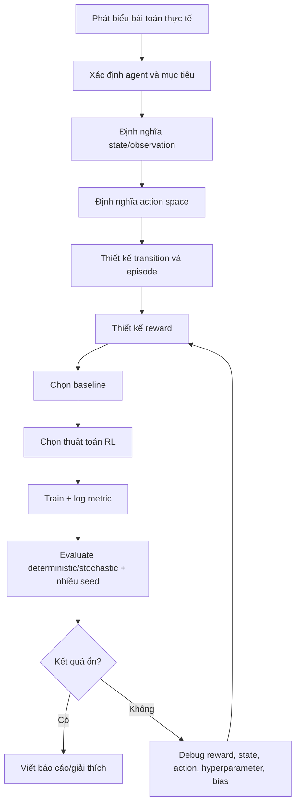

# Flow A-Z để định nghĩa và xử lý bài toán Reinforcement Learning

> **Mục tiêu của file này:** dùng để ôn tập offline trước khi thi. Nội dung tập trung vào cách tự định nghĩa bài toán RL từ đầu đến cuối: môi trường, state, action, reward, thuật toán, baseline, đánh giá, debug agent bị bias/collapse và cách chỉnh tham số.
>
> **Nguyên tắc trong phòng thi:** nếu đề thi không cho dùng AI tạo sinh, hãy chỉ dùng kiến thức đã ôn và tài liệu được phép. File này được viết như một checklist để bạn tự triển khai và giải thích bằng lời.

---

## 0. Bức tranh tổng quát

Một bài toán RL hoàn chỉnh thường trả lời được 10 câu hỏi sau:

| Câu hỏi | Ý nghĩa |
|---|---|
| 1. Agent là ai? | Thành phần ra quyết định. |
| 2. Environment là gì? | Thế giới phản hồi lại hành động của agent. |
| 3. State/Observation gồm gì? | Agent nhìn thấy thông tin nào trước khi chọn hành động. |
| 4. Action gồm gì? | Agent được phép làm gì. |
| 5. Transition diễn ra thế nào? | Hành động làm hệ thống chuyển sang trạng thái mới ra sao. |
| 6. Reward là gì? | Tín hiệu số hóa mục tiêu tối ưu. |
| 7. Episode kết thúc khi nào? | Thành công, thất bại, hết thời gian, hết tài nguyên, timeout. |
| 8. Thuật toán nào phù hợp? | DQN, REINFORCE, Actor-Critic, A2C, PPO, SAC,... |
| 9. Đánh giá bằng metric nào? | Reward, latency, success rate, crash rate, p95, safety, cost,... |
| 10. Debug/tuning thế nào? | Chỉnh reward, exploration, learning rate, entropy, gamma, batch size,... |

Flow tư duy nhanh:



---

## 1. Nhận diện bài toán có thật sự cần RL không

Không phải bài nào cũng nên dùng RL. Trước khi định nghĩa MDP, cần kiểm tra:

### 1.1. Khi nào nên dùng RL?

Dùng RL khi bài toán có các đặc điểm:

- Có **chuỗi quyết định theo thời gian**.
- Hành động hiện tại ảnh hưởng đến trạng thái/tình huống tương lai.
- Có trade-off ngắn hạn và dài hạn.
- Khó viết rule tối ưu bằng tay.
- Có môi trường mô phỏng hoặc dữ liệu tương tác để agent học thử-sai.

Ví dụ phù hợp:

- Điều khiển robot.
- Game.
- Điều phối tài nguyên.
- Edge offloading: chọn chạy trên device hay edge theo workload/network.
- Predictive maintenance: chọn bay tiếp, chuyển hướng, bảo trì.
- Tối ưu lịch trình, định tuyến, năng lượng, tài nguyên cloud.

### 1.2. Khi nào không cần RL?

Không nên ép RL nếu:

- Chỉ là bài toán dự đoán nhãn: dùng supervised learning.
- Chỉ là tìm đường có bản đồ đầy đủ: dùng Dijkstra/A*/optimization có thể đủ.
- Không có tương tác tuần tự, mỗi quyết định độc lập: có thể là contextual bandit.
- Reward không đo được hoặc mô phỏng sai quá nhiều.
- Action có rủi ro cao nhưng không có simulator an toàn.

### 1.3. Câu trả lời mẫu khi bị hỏi “Tại sao dùng RL?”

> Nhóm dùng RL vì bài toán không chỉ là dự đoán một giá trị, mà là ra quyết định tuần tự. Mỗi hành động làm thay đổi trạng thái tương lai và ảnh hưởng đến tổng reward dài hạn. Do đó, RL phù hợp hơn so với supervised learning thuần túy, vì agent học chính sách chọn hành động để tối ưu mục tiêu tích lũy thay vì chỉ học dự đoán đầu ra tại một thời điểm.

---

## 2. Công thức hóa bài toán theo MDP/POMDP

Một bài toán RL chuẩn thường được mô hình hóa dưới dạng MDP:

```text
MDP = (S, A, P, R, gamma, horizon)
```

Trong đó:

| Thành phần | Ý nghĩa | Câu hỏi cần trả lời |
|---|---|---|
| S | State space | Trạng thái thật của hệ thống gồm gì? |
| A | Action space | Agent được phép chọn hành động nào? |
| P | Transition dynamics | Hành động làm trạng thái thay đổi thế nào? |
| R | Reward function | Tốt/xấu được lượng hóa ra sao? |
| gamma | Discount factor | Agent quan tâm tương lai nhiều hay ít? |
| horizon | Độ dài episode | Một episode kéo dài bao lâu? |

### 2.1. MDP và POMDP khác nhau thế nào?

- **MDP:** state hiện tại chứa đủ thông tin cần thiết để quyết định tối ưu. Nói cách khác, quá khứ không còn cần thiết nếu đã biết state hiện tại.
- **POMDP:** agent chỉ quan sát được một phần trạng thái thật. Observation không đủ đầy đủ, nên cần lịch sử, sliding window, RNN/GRU/LSTM hoặc belief state.

Câu trả lời mẫu:

> Nếu state chứa đủ thông tin về hệ thống tại thời điểm hiện tại thì có thể xem là MDP. Nếu agent chỉ nhìn thấy một phần thông tin, ví dụ sensor bị nhiễu hoặc không biết trạng thái ẩn của máy móc, bài toán gần với POMDP hơn. Khi đó dùng sliding window hoặc RNN không phải là “vi phạm MDP”, mà là cách mở rộng observation để xấp xỉ trạng thái đầy đủ hơn.

---

## 3. Xác định Agent

Agent là thực thể **ra quyết định**. Khi viết báo cáo hoặc trả lời thi, đừng nói chung chung “hệ thống học”. Hãy chỉ rõ:

- Agent nhận observation nào.
- Agent chọn action nào.
- Action ảnh hưởng gì đến môi trường.
- Agent được thưởng/phạt theo tiêu chí nào.

Ví dụ:

| Bài toán | Agent |
|---|---|
| Edge offloading | Bộ điều phối quyết định chạy task trên device hay edge. |
| Aircraft maintenance | Bộ điều khiển quyết định tiếp tục bay, chuyển hướng, hạ cánh, bảo trì. |
| Game | Nhân vật/người chơi ảo. |
| Robot | Bộ điều khiển động cơ/di chuyển. |
| Cloud resource allocation | Scheduler phân bổ tài nguyên. |

Câu trả lời mẫu:

> Trong bài toán này, agent không phải toàn bộ hệ thống, mà là module ra quyết định. Environment cung cấp trạng thái hiện tại, agent chọn hành động, sau đó environment tính trạng thái mới và reward.

---

## 4. Thiết kế Environment

Environment là phần quan trọng nhất. Một environment tốt cần có:

```text
reset() -> observation, info
step(action) -> next_observation, reward, terminated, truncated, info
```

### 4.1. reset()

`reset()` dùng để bắt đầu episode mới.

Checklist:

- Đưa biến thời gian/step_count về 0.
- Sinh hoặc nạp state ban đầu.
- Reset tài nguyên: fuel, queue, health, RUL, position,...
- Trả về observation hợp lệ.
- Nếu có random seed, phải kiểm soát được seed để tái lập kết quả.

### 4.2. step(action)

`step(action)` mô tả một bước tương tác.

Checklist:

1. Kiểm tra action hợp lệ.
2. Tính hậu quả của action.
3. Tính reward.
4. Cập nhật state.
5. Kiểm tra điều kiện kết thúc.
6. Trả về `next_obs, reward, terminated, truncated, info`.

### 4.3. terminated và truncated khác gì nhau?

| Biến | Ý nghĩa |
|---|---|
| terminated | Episode kết thúc vì trạng thái tự nhiên: thành công/thất bại/crash/goal reached. |
| truncated | Episode bị cắt vì giới hạn ngoài: hết max_steps, timeout, giới hạn thời gian. |

Ví dụ:

- Máy bay rơi: `terminated=True`.
- Máy bay đến đích: `terminated=True`.
- Hết 500 bước nhưng chưa đến đích: `truncated=True`.
- Edge offloading lab chỉ có max_steps = 50, không có success/failure terminal, nên `terminated=False`, `truncated=True` khi đủ 50 bước.

### 4.4. info dictionary nên chứa gì?

`info` không phải input để agent học trực tiếp, nhưng rất quan trọng để debug và đánh giá.

Nên log:

- Reward thành phần: `r_latency`, `r_safety`, `r_progress`, `r_maint`,...
- Action name.
- Latency/cost/energy thực tế.
- Event: `ARRIVED`, `CRASHED`, `TIMEOUT`, `MAINTAINED`,...
- Constraint violation.
- Các giá trị trung gian để giải thích reward.

Câu trả lời mẫu:

> `info` giúp ta kiểm chứng môi trường và phân tích hành vi agent. Agent có thể không dùng trực tiếp `info`, nhưng người thiết kế dùng nó để biết reward đến từ đâu, action có bị lệch không, và lỗi nằm ở environment hay thuật toán.

---

## 5. Thiết kế State/Observation

State là thông tin agent dùng để quyết định. Đây là nơi dễ sai nhất.

### 5.1. Nguyên tắc chọn state

State nên có các thông tin:

- Liên quan trực tiếp đến quyết định.
- Có thể quan sát được tại thời điểm ra quyết định.
- Không leak thông tin tương lai.
- Có scale hợp lý hoặc được normalize.
- Không dư thừa quá mức gây nhiễu.

### 5.2. Ví dụ state trong Edge Offloading

```text
s = [input_size, workload, uplink_rate, edge_queue]
```

Ý nghĩa:

| Thành phần | Ý nghĩa |
|---|---|
| input_size | Dữ liệu cần upload, ảnh hưởng upload delay. |
| workload | Khối lượng tính toán, ảnh hưởng compute delay. |
| uplink_rate | Tốc độ mạng, ảnh hưởng upload delay. |
| edge_queue | Hàng đợi edge, ảnh hưởng queueing delay. |

Với state này, agent có đủ thông tin để so sánh local latency và edge latency.

### 5.3. State thiếu thông tin gây hậu quả gì?

Nếu state thiếu biến quan trọng, agent có thể học sai.

Ví dụ:

- Không đưa `uplink_rate` vào state nhưng reward phụ thuộc upload delay: agent không biết khi nào edge tốt/xấu.
- Không đưa `edge_queue`: agent dễ offload quá nhiều dù edge đang nghẽn.
- Không đưa fuel/health/RUL trong bài toán máy bay: agent không biết rủi ro dài hạn.

### 5.4. State dư thông tin gây hậu quả gì?

State quá nhiều biến không liên quan có thể:

- Làm training chậm.
- Tăng nhiễu.
- Làm agent học correlation giả.
- Dễ overfit simulator.

### 5.5. Có cần normalize state không?

Thường là **có**, nhất là neural network.

Ví dụ state:

```text
input_size: 1 -> 20
workload: 0.1 -> 3.0
uplink_rate: 2 -> 20
edge_queue: 0 -> 200
```

Nếu không normalize, `edge_queue` có scale lớn hơn, network có thể ưu tiên sai biến này.

Cách normalize min-max:

```text
x_norm = (x - low) / (high - low)
```

Câu trả lời mẫu:

> Normalize không làm thay đổi bản chất bài toán, mà đưa các biến về cùng thang đo để neural network học ổn định hơn. Nếu một biến có giá trị lớn hơn nhiều, gradient có thể bị chi phối bởi biến đó dù nó không quan trọng tương ứng.

---

## 6. Thiết kế Action Space

Action là tập lựa chọn của agent.

### 6.1. Các loại action space

| Loại | Ví dụ | Thuật toán phù hợp |
|---|---|---|
| Discrete | 0=device, 1=edge | DQN, A2C, PPO, REINFORCE |
| MultiDiscrete | chọn máy chủ + mức ưu tiên | PPO, A2C, custom policy |
| Continuous | lực đẩy, góc lái, tốc độ | PPO, SAC, TD3, DDPG |
| Hybrid | vừa chọn mode vừa chọn tham số liên tục | PPO custom, hierarchical RL |

### 6.2. Nguyên tắc thiết kế action

Action nên:

- Đủ biểu đạt quyết định cần học.
- Không quá lớn nếu chưa cần thiết.
- Không chứa hành động bất khả thi.
- Có thể kiểm tra invalid action.

### 6.3. Ví dụ action trong Edge Offloading

```text
A = {0, 1}
0 = execute locally on device
1 = offload to edge
```

Đây là bài toán action rời rạc nhị phân, nên có thể dùng DQN, policy gradient, Actor-Critic, A2C hoặc PPO.

### 6.4. Khi nào action space sai?

Các dấu hiệu:

- Agent luôn chọn một action vì action khác gần như luôn bị phạt.
- Có action không bao giờ hợp lý.
- Action quá thô, không đủ điều khiển.
- Action quá mịn, agent khó khám phá.
- Có invalid action nhưng môi trường không xử lý rõ.

Cách xử lý:

- Gộp action hiếm/khó học.
- Tách action phức tạp thành nhiều cấp.
- Thêm action mask nếu có hành động không hợp lệ theo state.
- Điều chỉnh reward để không triệt tiêu một action từ đầu.

---

## 7. Thiết kế Reward Function

Reward là “ngôn ngữ” để nói với agent điều gì tốt/xấu. Sai reward thì agent học sai dù thuật toán đúng.

### 7.1. Nguyên tắc thiết kế reward

Reward tốt nên:

- Bám sát mục tiêu thật.
- Có scale ổn định.
- Không quá sparse nếu bài toán dài.
- Không khuyến khích hành vi gian lận reward.
- Cân bằng giữa reward ngắn hạn và dài hạn.
- Có thể giải thích bằng công thức và ví dụ.

### 7.2. Reward chính và reward phụ

Reward thường gồm:

```text
r_total = r_objective + r_safety + r_progress + r_terminal + r_penalty
```

| Thành phần | Vai trò |
|---|---|
| r_objective | Mục tiêu chính: giảm latency, tăng profit, giảm cost. |
| r_safety | Phạt rủi ro, crash, vi phạm constraint. |
| r_progress | Khuyến khích tiến gần mục tiêu. |
| r_terminal | Thưởng/phạt khi kết thúc episode. |
| r_penalty | Phạt hành động xấu: tốn năng lượng, invalid action, delay. |

### 7.3. Reward âm có vấn đề không?

Không. Reward có thể âm hoàn toàn.

Ví dụ:

```text
reward = - latency / 1000
```

Agent vẫn tối đa hóa reward. Vì reward là số âm, reward “cao hơn” nghĩa là ít âm hơn.

Ví dụ:

| Latency | Reward |
|---:|---:|
| 500 ms | -0.5 |
| 1500 ms | -1.5 |

`-0.5` tốt hơn `-1.5`, nên agent sẽ học giảm latency.

### 7.4. Tại sao phải chia reward cho 1000 hoặc normalize?

Chia reward để scale nhỏ hơn, giúp học ổn định.

Nếu latency tính bằng ms, giá trị có thể hàng trăm/hàng nghìn:

```text
reward = -1500
```

Gradient có thể lớn, critic khó học, loss dao động mạnh.

Chia 1000:

```text
reward = -1.5
```

Dễ học hơn nhưng vẫn giữ cùng thứ tự tối ưu.

Câu trả lời mẫu:

> Việc chia cho 1000 không thay đổi hành động tối ưu vì đây là phép scale tuyến tính. Nó chỉ giúp reward nằm trong khoảng số dễ học hơn, giảm dao động gradient và giúp thuật toán ổn định hơn.

### 7.5. Tại sao không trừ một số nhỏ thay vì chia?

Trừ là dịch chuyển reward, chia là thay đổi scale.

Ví dụ latency 1500:

```text
-1500 / 1000 = -1.5
-1500 + 1000 = -500
```

Trừ/cộng hằng số không giải quyết triệt để vấn đề scale nếu reward vẫn lớn. Chia giúp toàn bộ reward co lại.

### 7.6. Sparse reward và dense reward

| Loại | Mô tả | Ưu điểm | Nhược điểm |
|---|---|---|---|
| Sparse reward | Chỉ thưởng khi hoàn thành mục tiêu | Đúng mục tiêu cuối | Khó học, tín hiệu hiếm |
| Dense reward | Có reward từng bước | Dễ học hơn | Dễ reward hacking nếu thiết kế sai |

Ví dụ sparse:

```text
+100 nếu đến đích
-100 nếu crash
0 ở các bước còn lại
```

Ví dụ dense:

```text
+ tiến gần mục tiêu
- tốn fuel
- tăng rủi ro
+ đến đích
- crash
```

### 7.7. Reward hacking là gì?

Reward hacking xảy ra khi agent tối ưu công thức reward nhưng không đạt mục tiêu thật.

Ví dụ:

- Thưởng quá nhiều cho “tiến gần đích”, agent đi vòng quanh vùng gần đích để farm reward.
- Phạt crash quá nhẹ, agent chọn đường nhanh nhưng nguy hiểm.
- Thưởng bảo trì quá cao, agent bảo trì quá sớm hoặc quá nhiều.
- Phạt latency nhưng không phạt overload, agent đẩy hết task lên edge làm queue nghẽn.

Cách xử lý:

- Log từng reward component.
- Kiểm tra action distribution.
- Thêm terminal reward/phạt rõ.
- Đặt constraint cứng nếu hành vi không được phép.
- Dùng baseline heuristic để so sánh.

### 7.8. Checklist kiểm tra reward

- Dấu reward đúng chưa? Cái cần giảm có đang bị phạt không?
- Reward tốt có lớn hơn reward xấu không?
- Scale các thành phần có lệch nhau quá không?
- Terminal reward có quá lớn làm agent bỏ qua reward từng bước không?
- Reward phụ có làm lệch mục tiêu chính không?
- Agent có thể “gian lận” reward không?
- Có log reward component trong `info` không?

---

## 8. Ví dụ hoàn chỉnh: Edge Offloading

### 8.1. Phát biểu bài toán

Hệ thống có hai nơi xử lý task:

- Device: xử lý local, không cần upload nhưng CPU yếu.
- Edge: CPU mạnh hơn nhưng phải upload dữ liệu và chờ hàng đợi.

Tại mỗi bước, agent chọn:

```text
0 = xử lý trên device
1 = offload lên edge
```

Mục tiêu: giảm latency.

### 8.2. State

```text
s = [input_size, workload, uplink_rate, edge_queue]
```

| Biến | Khoảng | Ý nghĩa |
|---|---:|---|
| input_size | [1, 20] Mbit | Dữ liệu cần truyền lên edge. |
| workload | [0.1, 3.0] Gcycles | Khối lượng tính toán. |
| uplink_rate | [2, 20] Mbps | Tốc độ upload. |
| edge_queue | [0, 200] ms | Thời gian chờ tại edge. |

### 8.3. Action

```text
A = {0, 1}
0 = device
1 = edge
```

### 8.4. Latency

Device latency:

```text
T_device = (workload / f_device) * 1000
```

Edge latency:

```text
T_upload = (input_size / uplink_rate) * 1000
T_edge = T_upload + edge_queue + (workload / f_edge) * 1000
```

Với:

```text
f_device = 1.0 GHz
f_edge = 5.0 GHz
```

### 8.5. Reward

```text
reward = - selected_latency / 1000
```

Ý nghĩa:

- Latency càng thấp thì reward càng cao.
- Chia 1000 để reward có scale nhỏ hơn.
- Đây là dense reward vì mỗi step đều có reward.

### 8.6. Episode

```text
max_steps = 50
terminated = False
truncated = True khi step_count >= 50
```

Vì bài toán này không có trạng thái thành công/thất bại tự nhiên, episode chỉ kết thúc do giới hạn số bước.

### 8.7. Baseline

Nên có 4 baseline:

| Baseline | Ý nghĩa |
|---|---|
| Random | Mốc yếu, chọn ngẫu nhiên. |
| Device-only | Luôn xử lý local. |
| Edge-only | Luôn offload. |
| Greedy latency | Tính cả hai latency rồi chọn cái nhỏ hơn. |

Greedy là benchmark mạnh vì nó biết công thức latency ở mỗi bước.

### 8.8. Thuật toán phù hợp

Vì action rời rạc, có thể dùng:

- REINFORCE: đơn giản nhưng variance cao.
- Actor-Critic: ổn định hơn nhờ critic.
- A2C: bản thực dụng của actor-critic.
- PPO: thường ổn định, dễ tune hơn policy gradient cơ bản.
- DQN: phù hợp discrete action, đặc biệt nếu cần Q-learning off-policy.

Câu trả lời mẫu:

> Với Edge Offloading, action space là Discrete(2), nên cả DQN và các thuật toán policy-based như A2C/PPO đều dùng được. Nếu muốn học Q-value cho từng action thì dùng DQN. Nếu muốn học trực tiếp policy và giữ ổn định khi update thì PPO/A2C phù hợp.

---

## 9. Baseline và vì sao bắt buộc phải có

Baseline giúp trả lời câu hỏi: “RL có thật sự học được gì không?”

### 9.1. Các baseline phổ biến

| Baseline | Dùng khi nào |
|---|---|
| Random | Mốc thấp nhất, kiểm tra RL có hơn random không. |
| Fixed policy | Luôn chọn một action, ví dụ device-only. |
| Rule-based | Dùng luật thủ công theo chuyên gia. |
| Greedy | Chọn action tốt nhất trước mắt. |
| Oracle | Biết thông tin tương lai hoặc công thức thật, dùng làm upper bound. |
| Previous method | So với phương pháp cũ trong bài báo/hệ thống. |

### 9.2. Nếu RL thua baseline thì sao?

Không được kết luận vội là RL vô dụng. Cần kiểm tra:

- Reward có đúng không?
- State có đủ thông tin không?
- Agent có exploration không?
- Training đủ lâu chưa?
- Evaluation có deterministic/stochastic đúng không?
- Baseline có dùng thông tin mà agent không có không?
- Hyperparameter có quá lệch không?

Câu trả lời mẫu:

> Nếu RL thua greedy, có thể do greedy đã là heuristic rất mạnh trong môi trường đơn giản và biết công thức tức thời. RL vẫn có ý nghĩa khi môi trường phức tạp hơn, có uncertainty, delay dài hạn, constraint hoặc dynamics không biết trước.

---

## 10. Chọn thuật toán RL

### 10.1. Bảng chọn nhanh

| Tình huống | Thuật toán nên cân nhắc |
|---|---|
| State/action nhỏ, muốn hiểu cơ bản | Q-learning, SARSA |
| Action rời rạc, state lớn | DQN |
| Action rời rạc, muốn policy trực tiếp | REINFORCE, Actor-Critic, A2C, PPO |
| Cần ổn định, dễ dùng thực nghiệm | PPO |
| Continuous action | PPO, SAC, TD3, DDPG |
| Reward sparse | PPO + reward shaping, curiosity, HER nếu goal-based |
| Môi trường nhiều nhiễu | PPO/A2C với nhiều seed, normalize obs/reward |
| Cần sample efficiency | Off-policy: DQN, SAC, TD3 |
| Multi-agent | MARL, independent PPO/DQN, centralized critic |

### 10.2. DQN

DQN học hàm Q:

```text
Q(s, a) = expected return nếu ở state s chọn action a
```

Phù hợp khi:

- Action discrete.
- Muốn học giá trị từng action.
- Có replay buffer.

Thành phần quan trọng:

- Replay buffer.
- Target network.
- Epsilon-greedy exploration.
- Bellman target.

Hyperparameter hay hỏi:

| Tham số | Ý nghĩa |
|---|---|
| learning_rate | Tốc độ cập nhật mạng Q. |
| buffer_size | Số transition lưu lại. |
| batch_size | Số mẫu lấy từ replay mỗi lần update. |
| gamma | Mức quan tâm reward tương lai. |
| exploration_fraction | Tỷ lệ thời gian giảm epsilon. |
| exploration_initial_eps | Epsilon ban đầu. |
| exploration_final_eps | Epsilon cuối. |
| target_update_interval | Bao lâu cập nhật target network. |

Dấu hiệu cần chỉnh:

| Triệu chứng | Có thể do | Cách sửa |
|---|---|---|
| Q-value nổ lớn | learning rate cao, reward scale lớn | Giảm lr, normalize reward, gradient clip |
| Không khám phá | epsilon giảm quá nhanh | Tăng exploration_fraction/final_eps |
| Học chậm | lr thấp, buffer chưa đủ | Tăng lr nhẹ, train lâu hơn |
| Dao động mạnh | target update quá thường xuyên | Tăng target_update_interval |

### 10.3. REINFORCE

REINFORCE là policy gradient cơ bản.

Ưu điểm:

- Dễ hiểu.
- Học trực tiếp policy.

Nhược điểm:

- Variance cao.
- Cần nhiều episode.
- Dễ dao động.

Phù hợp để học lý thuyết, ít phù hợp nếu cần hiệu năng ổn định.

### 10.4. Actor-Critic

Actor-Critic gồm:

- Actor: chọn action.
- Critic: ước lượng value để hướng dẫn actor.

Loss thường gồm:

```text
loss = actor_loss + c1 * critic_loss - c2 * entropy
```

Ý nghĩa:

| Thành phần | Vai trò |
|---|---|
| actor_loss | Cập nhật policy theo advantage. |
| critic_loss | Giúp value estimate gần TD target. |
| entropy bonus | Khuyến khích exploration. |

Nếu agent bị collapse vào một action, thường tăng entropy hoặc điều chỉnh reward/exploration.

### 10.5. A2C

A2C là Advantage Actor-Critic đồng bộ.

Phù hợp khi:

- Muốn actor-critic ổn định hơn bản tự viết.
- Có discrete hoặc continuous action.
- Muốn dùng implementation chuẩn như Stable-Baselines3.

Tham số hay hỏi:

| Tham số | Ý nghĩa |
|---|---|
| n_steps | Số bước rollout trước mỗi update. |
| gamma | Discount future reward. |
| gae_lambda | Làm mượt advantage nếu dùng GAE. |
| ent_coef | Hệ số entropy khuyến khích exploration. |
| vf_coef | Trọng số critic loss. |
| max_grad_norm | Gradient clipping. |

### 10.6. PPO

PPO là thuật toán policy-gradient/actor-critic rất phổ biến vì update ổn định.

Ý tưởng chính:

```text
Không cho policy mới lệch quá xa policy cũ trong một lần update.
```

Thành phần quan trọng:

| Tham số | Ý nghĩa |
|---|---|
| learning_rate | Tốc độ học. |
| n_steps | Số bước thu thập rollout trước update. |
| batch_size | Mini-batch khi optimize. |
| n_epochs | Số lần lặp lại trên cùng rollout data. |
| gamma | Discount factor. |
| gae_lambda | Cân bằng bias/variance của advantage. |
| clip_range | Giới hạn policy update. |
| ent_coef | Khuyến khích exploration. |
| vf_coef | Trọng số value loss. |

Giải thích `n_epochs`:

> Trong PPO, sau khi thu thập một batch rollout, thuật toán không chỉ dùng dữ liệu đó một lần. `n_epochs` là số vòng lặp tối ưu trên cùng dữ liệu rollout. Ví dụ `n_epochs=10` nghĩa là PPO đi qua dữ liệu rollout 10 lần để cập nhật policy/value network. Quá thấp thì học chưa đủ, quá cao thì dễ overfit batch cũ hoặc làm policy lệch quá mức.

Giải thích `clip_range`:

> `clip_range` giới hạn mức thay đổi policy mới so với policy cũ. Nếu clip quá lớn, policy update mạnh và dễ bất ổn. Nếu clip quá nhỏ, agent học chậm.

### 10.7. SAC/TD3/DDPG

Dùng cho continuous control.

| Thuật toán | Khi dùng |
|---|---|
| DDPG | Continuous action, nhưng nhạy hyperparameter. |
| TD3 | Cải tiến DDPG, ổn định hơn. |
| SAC | Continuous action, sample efficient, exploration tốt nhờ entropy. |

---

## 11. Hyperparameter: ý nghĩa và cách chỉnh

### 11.1. Nhóm tham số chung

| Tham số | Tăng lên thì sao? | Giảm xuống thì sao? |
|---|---|---|
| learning_rate | Học nhanh hơn nhưng dễ dao động | Ổn định hơn nhưng học chậm |
| gamma | Quan tâm tương lai hơn | Tập trung reward ngắn hạn hơn |
| batch_size | Gradient ổn định hơn, tốn RAM | Nhiễu hơn, update nhanh hơn |
| total_timesteps | Có thêm thời gian học | Học chưa đủ nếu quá thấp |
| seed | Kiểm tra độ ổn định | Một seed không đủ kết luận |
| reward scale | Gradient lớn/nhỏ ảnh hưởng training | Scale hợp lý giúp học ổn định |

### 11.2. PPO hyperparameter

| Tham số | Nếu agent học không ổn | Gợi ý chỉnh |
|---|---|---|
| learning_rate | Reward dao động, policy collapse | Giảm 2-10 lần |
| ent_coef | Agent chọn lặp một action | Tăng entropy coefficient |
| clip_range | Update quá mạnh | Giảm clip_range |
| n_steps | Advantage nhiễu hoặc thiếu context | Tăng n_steps |
| batch_size | Loss nhiễu | Tăng batch_size nếu đủ RAM |
| n_epochs | Học chậm hoặc overfit rollout | Tăng nhẹ nếu học chậm, giảm nếu dao động |
| gamma | Không quan tâm kết quả dài hạn | Tăng gamma |
| gae_lambda | Advantage variance cao | Giảm nhẹ hoặc dùng 0.9-0.95 |

### 11.3. DQN hyperparameter

| Tham số | Vấn đề | Gợi ý |
|---|---|---|
| epsilon | Không khám phá | Tăng final_eps hoặc giảm tốc độ decay |
| buffer_size | Overfit data gần nhất | Tăng buffer |
| target_update_interval | Q-value dao động | Cập nhật target chậm hơn |
| train_freq | Update quá ít/quá nhiều | Cân bằng với env step |
| learning_starts | Học khi buffer còn nghèo | Tăng learning_starts |
| gamma | Myopic hoặc quá dài hạn | Chỉnh theo horizon |

### 11.4. Entropy coefficient là gì?

Entropy đo độ ngẫu nhiên của policy.

- Entropy cao: agent thử nhiều action.
- Entropy thấp: agent tự tin/chọn ít action.

`ent_coef` càng lớn thì policy càng được khuyến khích khám phá.

Câu trả lời mẫu:

> Entropy coefficient không phải epsilon. Entropy là regularization trong policy loss, khuyến khích phân phối hành động không quá chắc chắn. Epsilon là xác suất chọn action ngẫu nhiên, thường dùng trong DQN epsilon-greedy. Cả hai đều liên quan exploration nhưng cơ chế khác nhau.

### 11.5. Epsilon khác entropy coefficient thế nào?

| Tiêu chí | Epsilon | Entropy coefficient |
|---|---|---|
| Thường dùng | DQN/Q-learning | Policy gradient/PPO/A2C/SAC |
| Cơ chế | Xác suất chọn action random | Thêm entropy vào loss |
| Tác động | Ép agent random trực tiếp | Khuyến khích policy phân tán |
| Giảm dần? | Thường decay theo thời gian | Có thể cố định hoặc schedule |

---

## 12. Agent bị bias/collapse: nhận diện và sửa

“Bias” ở đây không chỉ là bias xã hội, mà là agent học lệch hành vi.

### 12.1. Action bias

Dấu hiệu:

- Agent gần như luôn chọn một action.
- Device % = 100% hoặc Edge % = 100%.
- Policy entropy giảm rất nhanh.

Nguyên nhân:

- Reward làm một action luôn có vẻ tốt hơn.
- Exploration quá thấp.
- State thiếu thông tin phân biệt khi nào action A/B tốt.
- Evaluation dùng deterministic nên nhìn như collapse, nhưng stochastic vẫn đa dạng.
- Training quá ngắn, agent kẹt local optimum.

Cách sửa:

- Kiểm tra reward bằng ví dụ tính tay.
- Tăng entropy coefficient hoặc epsilon.
- Normalize state/reward.
- Thêm baseline greedy để xem action tối ưu phân bố ra sao.
- Train lâu hơn hoặc đổi seed.
- Giảm learning rate nếu policy chuyển quá nhanh sang một action.

### 12.2. Reward bias

Dấu hiệu:

- Agent đạt reward cao nhưng hành vi vô lý.
- Một reward component áp đảo toàn bộ.
- Agent “farm” reward phụ.

Ví dụ:

- `r_progress` quá lớn làm agent cứ tiến-lùi để nhận thưởng.
- `r_maint` quá cao làm agent bảo trì liên tục.
- Phạt crash quá nhẹ làm agent chọn đường nguy hiểm.

Cách sửa:

- Log từng reward component.
- Vẽ reward component theo episode.
- Giới hạn reward phụ.
- Dùng terminal reward/phạt rõ hơn.
- Chuyển một số điều kiện thành constraint cứng.

### 12.3. State distribution bias

Dấu hiệu:

- Agent tốt trên training nhưng kém trên test.
- Agent chỉ học tốt một vùng state.
- Khi môi trường thay đổi nhẹ, performance giảm mạnh.

Nguyên nhân:

- State sampling không bao phủ đủ tình huống.
- Simulator quá đơn giản.
- Training seed quá ít.
- Dữ liệu train/test lệch distribution.

Cách sửa:

- Randomize nhiều điều kiện môi trường.
- Train nhiều seed.
- Domain randomization.
- Đánh giá theo scenario khó/dễ riêng.
- Stress test với edge cases.

### 12.4. Exploration bias

Dấu hiệu:

- Agent không thử action hiếm.
- Học chậm hoặc stuck.
- Entropy giảm sớm.

Cách sửa:

- Tăng entropy coefficient.
- Tăng epsilon hoặc decay chậm hơn.
- Dùng reward shaping để tạo tín hiệu học ban đầu.
- Khởi tạo policy ít lệch hơn.
- Dùng curriculum learning.

### 12.5. Implementation bias

Dấu hiệu:

- Kết quả vô lý dù công thức đúng trên giấy.
- Evaluation và training khác nhau.
- Reward sign sai.
- Observation normalize ở train nhưng quên normalize ở eval.

Checklist:

- Train normalize thì eval cũng normalize.
- Reward sign đúng chưa?
- `terminated`/`truncated` đúng chưa?
- Action mapping có bị đảo không?
- Seed có cố định khi cần tái lập không?
- Observation shape đúng không?
- `info['latency']` có đúng selected action không?

### 12.6. Evaluation bias

Dấu hiệu:

- Một seed đẹp làm kết quả có vẻ tốt.
- Chỉ nhìn reward mà bỏ qua safety/cost.
- Dùng deterministic eval cho policy còn cần exploration.

Cách sửa:

- Evaluate nhiều seed.
- Báo cáo mean ± std.
- Dùng cả deterministic và stochastic nếu là policy stochastic.
- So sánh với baseline công bằng.
- Tách metric chính và metric an toàn.

---

## 13. Debugging protocol từ A-Z

Khi agent học sai, làm theo thứ tự này. Đừng chỉnh hyperparameter quá sớm nếu environment/reward còn sai.

### Bước 1: Check environment API

- Dùng `check_env` nếu dùng Gymnasium.
- Kiểm tra shape/dtype của observation.
- Kiểm tra action space.
- Chạy 5-10 step random rollout.
- In state, action, reward, info.

### Bước 2: Tính tay một vài transition

Ví dụ Edge Offloading:

```text
state = [input_size=10, workload=2, uplink_rate=10, edge_queue=100]
f_device = 1
f_edge = 5

T_device = 2/1 * 1000 = 2000 ms
T_upload = 10/10 * 1000 = 1000 ms
T_edge = 1000 + 100 + 2/5*1000 = 1500 ms
```

Vậy greedy nên chọn edge, reward = -1.5.

Nếu code không ra vậy, lỗi ở environment.

### Bước 3: Test baseline

Baseline cần hợp lý trước khi train RL.

- Random nằm giữa hoặc tệ hơn heuristic.
- Device-only/Edge-only phản ánh trade-off.
- Greedy phải tốt nếu công thức tức thời chính xác.

Nếu baseline đã sai, đừng train RL.

### Bước 4: Overfit môi trường nhỏ

Tạo môi trường cực đơn giản:

- State cố định.
- Action tốt rõ ràng.
- Reward rõ ràng.

Agent phải học được action đúng. Nếu không, lỗi thuật toán/implementation.

### Bước 5: Kiểm tra action distribution

Log:

```text
Device %
Edge %
Action histogram
Entropy
```

Nếu một action chiếm 100%, phải kiểm tra có hợp lý không. Có thể greedy cũng 100%, nhưng nếu greedy cân bằng mà agent 100% thì agent bị lệch.

### Bước 6: Kiểm tra reward component

Nếu reward tổng tăng nhưng behavior xấu, log từng phần:

```text
r_total
r_latency
r_safety
r_progress
r_terminal
```

### Bước 7: Kiểm tra learning curves

Cần theo dõi:

- Mean episode reward.
- Episode length.
- Policy loss.
- Value loss.
- Entropy.
- KL divergence nếu PPO.
- Explained variance nếu value function.

### Bước 8: Chỉnh hyperparameter có hệ thống

Không đổi 5 thứ cùng lúc. Chỉ đổi 1-2 tham số và ghi lại.

Thứ tự ưu tiên:

1. Reward scale/sign.
2. Observation normalization.
3. Learning rate.
4. Exploration: entropy/epsilon.
5. Training timesteps.
6. Batch/n_steps/n_epochs.
7. Architecture.
8. Algorithm.

---

## 14. Triệu chứng thường gặp và cách sửa nhanh

| Triệu chứng | Nguyên nhân có thể | Cách xử lý |
|---|---|---|
| Reward không tăng | Reward sai, lr thấp, train ngắn | Tính tay reward, tăng timesteps, chỉnh lr |
| Reward dao động mạnh | lr cao, reward scale lớn | Giảm lr, normalize reward, gradient clipping |
| Agent luôn chọn 1 action | Exploration thấp, reward lệch, state thiếu | Tăng entropy/epsilon, check reward, thêm state |
| Value loss rất lớn | Critic khó học, reward scale lớn | Normalize reward, giảm lr, tăng batch |
| Entropy về 0 quá sớm | Policy collapse | Tăng ent_coef, giảm lr |
| PPO KL quá cao | Update quá mạnh | Giảm lr, giảm clip_range, giảm n_epochs |
| DQN Q-value nổ | lr cao, target update sai | Giảm lr, target update chậm hơn, clip reward |
| Train tốt eval kém | Overfit seed/scenario | Nhiều seed, test distribution khác |
| Greedy hơn RL nhiều | Môi trường đơn giản, RL chưa học đủ | Train lâu hơn, tune, hoặc thừa nhận greedy mạnh |
| RL hơn reward nhưng metric xấu | Reward không khớp metric thật | Thiết kế lại reward theo metric chính |
| Agent học hành vi nguy hiểm | Safety penalty yếu | Tăng phạt safety hoặc dùng constraint cứng |
| Episode luôn timeout | Reward không khuyến khích hoàn thành | Thêm progress/terminal reward |

---

## 15. Đánh giá kết quả RL

Đừng chỉ báo cáo reward. Reward là tín hiệu học, không phải lúc nào cũng là metric nghiệp vụ.

### 15.1. Metric nên có

| Nhóm | Metric |
|---|---|
| Hiệu năng | average reward, average latency, cost, energy |
| Tail performance | p95 latency, worst-case cost |
| An toàn | crash rate, constraint violation, safety reward |
| Thành công | success rate, arrived count, completed tasks |
| Hành vi | action distribution, device/edge %, maintain count |
| Ổn định | mean ± std qua nhiều seed |
| Học | policy loss, value loss, entropy, KL, explained variance |

### 15.2. Deterministic vs stochastic evaluation

- Deterministic: chọn action có xác suất cao nhất. Phù hợp khi triển khai cần ổn định.
- Stochastic: sample theo policy distribution. Phù hợp để hiểu agent còn exploration/đa dạng không.

Câu trả lời mẫu:

> Deterministic evaluation cho biết chính sách triển khai ổn định ra sao. Stochastic evaluation cho biết phân phối policy thực sự và mức exploration còn lại. Nếu stochastic tốt hơn deterministic, có thể policy vẫn cần sự ngẫu nhiên để tránh kẹt trong một số trạng thái, hoặc deterministic argmax đang làm mất đa dạng hành động.

### 15.3. So sánh công bằng

Muốn so sánh công bằng:

- Cùng môi trường.
- Cùng seed hoặc nhiều seed tương đương.
- Cùng số episode evaluation.
- Cùng metric.
- Không cho baseline dùng thông tin mà RL không có, trừ khi ghi rõ là oracle/upper bound.

---

## 16. Viết báo cáo bài toán RL

Một phần báo cáo RL nên có cấu trúc:

```text
1. Problem statement
2. MDP formulation
   - Agent
   - State/Observation
   - Action
   - Transition
   - Reward
   - Episode termination
3. Baseline policies
4. Algorithms
5. Training setup
6. Evaluation metrics
7. Results
8. Analysis and limitations
```

### 16.1. Mẫu viết State

> Trạng thái tại thời điểm t được biểu diễn bởi vector `s_t = [...]`. Các thành phần này được chọn vì chúng ảnh hưởng trực tiếp đến quyết định của agent. Để tránh chênh lệch thang đo giữa các biến, observation được chuẩn hóa trước khi đưa vào neural network.

### 16.2. Mẫu viết Action

> Không gian hành động là rời rạc, gồm `A = {...}`. Mỗi action tương ứng với một quyết định cụ thể của agent. Cách thiết kế này giúp đơn giản hóa bài toán nhưng vẫn giữ được các lựa chọn chính cần tối ưu.

### 16.3. Mẫu viết Reward

> Reward được thiết kế để phản ánh mục tiêu tối ưu chính của bài toán. Vì mục tiêu là giảm latency, reward được định nghĩa là giá trị âm của latency sau khi scale. Nhờ đó, việc maximize reward tương đương với minimize latency.

### 16.4. Mẫu viết Baseline

> Các baseline được sử dụng để kiểm tra liệu agent RL có học được chính sách tốt hơn các quy tắc đơn giản hay không. Random policy đóng vai trò mốc thấp, fixed policies cho thấy hành vi cực đoan, trong khi greedy policy là heuristic mạnh dựa trên tối ưu tức thời.

### 16.5. Mẫu viết Algorithm

> Do action space là rời rạc và môi trường có tính tuần tự, nhóm lựa chọn các thuật toán policy/value-based phù hợp như DQN/PPO/A2C. PPO được ưu tiên trong thí nghiệm chính vì cơ chế clipped update giúp policy học ổn định hơn so với policy gradient cơ bản.

---

## 17. Câu hỏi vấn đáp thường gặp

### Câu 1. Reward âm thì agent có học được không?

Có. Agent tối đa hóa reward. Nếu reward là `-latency`, latency thấp hơn cho reward ít âm hơn, tức tốt hơn.

### Câu 2. Tại sao phải có baseline?

Baseline giúp biết RL có thật sự học được gì không. Nếu RL không hơn random hoặc rule-based, cần xem lại reward, state, thuật toán hoặc training setup.

### Câu 3. Tại sao dùng greedy làm benchmark?

Greedy chọn action tốt nhất trước mắt theo công thức/heuristic. Nó là mốc mạnh để đánh giá agent có học được logic tức thời hay không.

### Câu 4. Greedy tốt hơn RL thì RL có vô nghĩa không?

Không nhất thiết. Nếu môi trường đơn giản và greedy biết đầy đủ công thức, greedy có thể rất mạnh. RL hữu ích hơn khi dynamics phức tạp, không biết trước, có long-term trade-off hoặc nhiều constraint.

### Câu 5. Tại sao cần normalize observation?

Vì các feature có thang đo khác nhau. Nếu không normalize, neural network có thể bị chi phối bởi biến có giá trị số lớn hơn dù biến đó không quan trọng tương ứng.

### Câu 6. Agent bị bias chọn mãi một action thì làm gì?

Kiểm tra phân bố action của greedy/baseline, kiểm tra reward, tăng exploration, normalize state, giảm learning rate, train nhiều seed, và xem state có đủ thông tin để phân biệt khi nào nên chọn action khác không.

### Câu 7. PPO khác DQN thế nào?

DQN học Q-value cho từng action và thường dùng epsilon-greedy, replay buffer, target network. PPO học trực tiếp policy và dùng clipped objective để update ổn định. DQN phù hợp discrete action; PPO dùng được cả discrete và continuous.

### Câu 8. Entropy coefficient khác epsilon thế nào?

Epsilon là xác suất chọn action ngẫu nhiên trong epsilon-greedy, thường dùng ở DQN. Entropy coefficient là hệ số trong loss của policy-gradient, khuyến khích phân phối action không quá chắc chắn.

### Câu 9. `n_epochs` trong PPO là gì?

Là số lần thuật toán tối ưu trên cùng batch rollout. Tăng `n_epochs` giúp tận dụng dữ liệu hơn nhưng quá cao có thể overfit rollout cũ hoặc làm update quá mạnh.

### Câu 10. Tại sao dùng GRU/LSTM/sliding window có thể hợp lý trong RL?

Nếu observation hiện tại không đủ mô tả trạng thái thật, bài toán là POMDP. Sliding window hoặc RNN giúp agent dùng lịch sử để xấp xỉ trạng thái đầy đủ hơn.

---

## 18. Template định nghĩa bài toán RL trong bài thi

Khi gặp đề mới, có thể điền theo mẫu:

```text
Bài toán: ...

1. Agent:
   - Agent là ...
   - Nhiệm vụ của agent là ...

2. Environment:
   - Environment mô phỏng ...
   - Sau mỗi action, environment cập nhật ...

3. State/Observation:
   s_t = [...]
   Giải thích từng biến:
   - ...
   - ...

4. Action:
   A = {...}
   - action 0 = ...
   - action 1 = ...

5. Transition:
   - Nếu agent chọn action ..., state thay đổi ...
   - Các yếu tố stochastic gồm ...

6. Reward:
   r_t = ...
   - Thành phần 1: ...
   - Thành phần 2: ...
   - Dấu âm/dương thể hiện ...
   - Có normalize/scale vì ...

7. Episode:
   - terminated khi ...
   - truncated khi ...

8. Baseline:
   - Random: ...
   - Rule-based/greedy: ...

9. Algorithm:
   - Chọn ... vì action space là ... và bài toán có ...

10. Evaluation:
   - Metric chính: ...
   - Metric phụ: ...
   - So sánh với baseline bằng ...
```

---

## 19. Template Gymnasium environment tối giản

```python
import gymnasium as gym
from gymnasium import spaces
import numpy as np

class MyEnv(gym.Env):
    def __init__(self):
        super().__init__()
        self.action_space = spaces.Discrete(2)
        self.observation_space = spaces.Box(
            low=np.array([...], dtype=np.float32),
            high=np.array([...], dtype=np.float32),
            dtype=np.float32
        )
        self.state = None
        self.step_count = 0
        self.max_steps = 100

    def reset(self, seed=None, options=None):
        super().reset(seed=seed)
        self.step_count = 0
        self.state = self._sample_initial_state()
        return self.state, {}

    def step(self, action):
        assert self.action_space.contains(action)

        reward, info = self._compute_reward_and_info(self.state, action)
        self.state = self._transition(self.state, action)

        self.step_count += 1
        terminated = self._is_terminal(self.state)
        truncated = self.step_count >= self.max_steps

        return self.state, reward, terminated, truncated, info
```

---

## 20. Checklist cuối trước khi nộp/trả lời

### 20.1. Checklist MDP

- [ ] Agent xác định rõ.
- [ ] Environment xác định rõ.
- [ ] State có đủ biến quan trọng.
- [ ] Action hợp lệ và không quá phức tạp.
- [ ] Reward đúng mục tiêu.
- [ ] Episode termination/truncation rõ.
- [ ] Có baseline.
- [ ] Có metric đánh giá ngoài reward.
- [ ] Có giải thích vì sao chọn thuật toán.

### 20.2. Checklist debug

- [ ] Random rollout chạy được.
- [ ] Tính tay reward khớp code.
- [ ] Baseline hợp lý.
- [ ] State/reward được normalize nếu cần.
- [ ] Action distribution không vô lý.
- [ ] Train/eval dùng cùng preprocessing.
- [ ] Đánh giá nhiều seed nếu có thể.
- [ ] Log reward component.

### 20.3. Checklist trả lời miệng

Khi bị hỏi “tại sao”, trả lời theo cấu trúc:

```text
Vì mục tiêu của bài toán là ..., nên nhóm thiết kế ...
Cách thiết kế này giúp agent ...
Nếu không làm như vậy thì ...
Nhóm kiểm chứng bằng ...
```

Ví dụ:

> Vì mục tiêu là giảm latency, nhóm đặt reward bằng âm của latency sau khi scale. Cách này biến bài toán minimize latency thành maximize reward. Nếu không scale, reward có thể quá lớn làm training không ổn định. Nhóm kiểm chứng bằng baseline device-only, edge-only và greedy latency.

---

## 21. Bản tóm tắt 1 trang để nhớ nhanh

```text
A-Z RL FLOW

1. Có cần RL không?
   - Có sequential decision không?
   - Action hiện tại ảnh hưởng tương lai không?

2. Define MDP/POMDP
   - S, A, P, R, gamma, horizon

3. Agent
   - Ai ra quyết định?

4. State
   - Agent nhìn thấy gì?
   - Có đủ thông tin không?
   - Có normalize không?

5. Action
   - Agent được làm gì?
   - Discrete hay continuous?

6. Environment
   - reset()
   - step(action)
   - terminated/truncated
   - info để debug

7. Reward
   - Mục tiêu chính là gì?
   - Reward âm/dương đúng chưa?
   - Có scale không?
   - Có reward hacking không?

8. Baseline
   - Random
   - Fixed policy
   - Greedy/rule-based

9. Algorithm
   - Discrete: DQN/PPO/A2C
   - Continuous: PPO/SAC/TD3
   - Simple: Q-learning/REINFORCE

10. Train
   - Log reward, loss, entropy, action distribution
   - Nhiều seed nếu có thể

11. Evaluate
   - Reward + metric nghiệp vụ
   - Deterministic/stochastic
   - So với baseline

12. Debug
   - Check env
   - Tính tay reward
   - Baseline trước RL
   - Nếu collapse: tăng exploration, check reward/state, giảm lr
```

---

## 22. Cách trả lời nếu đề cho một case mới

Ví dụ đề: “Thiết kế RL cho hệ thống chọn server xử lý request.”

Trả lời nhanh:

```text
Agent: scheduler chọn server.
Environment: hệ thống server với queue, latency, workload.
State: [request_size, cpu_required, queue_server_1, queue_server_2, network_delay, ...]
Action: chọn server i hoặc xử lý local.
Reward: - latency - alpha * energy_cost - beta * SLA_violation.
Episode: kết thúc sau N request hoặc khi hệ thống lỗi.
Baseline: random, least-queue, greedy latency.
Algorithm: DQN/PPO vì action chọn server là discrete.
Metric: avg latency, p95 latency, SLA violation rate, reward, action distribution.
Debug: kiểm tra reward sign, action bias về một server, queue dynamics, normalize state.
```

---

## 23. Ghi nhớ quan trọng

- RL không bắt đầu từ thuật toán, mà bắt đầu từ **môi trường và reward**.
- Reward sai thì thuật toán mạnh cũng học sai.
- Không có baseline thì không biết RL có tốt thật không.
- Agent chọn một action liên tục chưa chắc sai; phải so với greedy/optimal distribution.
- Normalize không phải mẹo phụ, mà thường là điều kiện để neural network học ổn định.
- Deterministic và stochastic evaluation có thể cho kết quả khác nhau.
- PPO ổn định không có nghĩa là không cần tune.
- DQN chỉ phù hợp trực tiếp cho action rời rạc.
- POMDP không phải lỗi; đó là lý do dùng lịch sử, sliding window hoặc RNN.
- Khi bí, quay về 4 thứ: **state đúng chưa, action đúng chưa, reward đúng chưa, baseline đúng chưa**.
